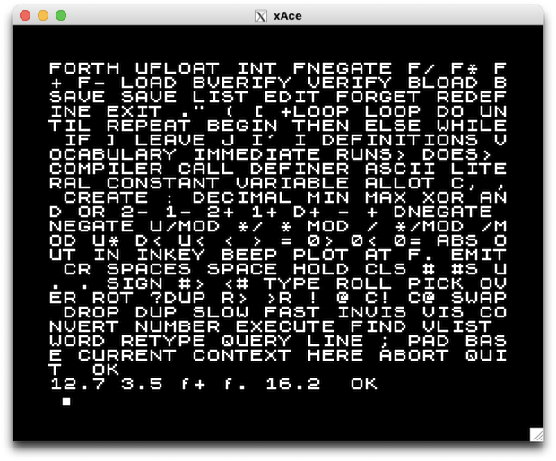

xAce
====

                  /\            
        __  __   /  \   ___ ___ 
        \ \/ /  / /\ \ / __/ _ \
         >  <  / ____ \ (_|  __/
        /_/\_\/_/    \_\___\___|
                                                          
	The Jupiter ACE is the real *outsider* micro from the 80's. 
	Instead of having BASIC as the programming language it had FORTH. 
	It was designed by two guys who had worked at Sinclair Research Ltd
	and were responsible for the famous Sinclair ZX81 and ZX Spectrum.
	They are Steven Vickers and Richard Altwasser.
	For a FAQ (2010) see
	http://www.robsons.org.uk/archive/users.aol.com/autismuk/ace/faq.htm

	I made it for the fun of it. As a base I used Russell Marks
	ZX81 emulator xz81. Which he based on Ian Collier xz80, a 
	ZX Spectrum emulator for X. The xz81 can be found (2010) at 
	http://www.zx81.nl/dload/emulators/unix/z81-0.2.tar.gz

________________________________________________________________________________
4 Sep 2022

Updated to build xAce on Linux and MacOS.

Linux
-----

To build and run xAce on Linux:

    cd xAce-0.5
    cmake .
    make
    src/xace

MacOS
-----

To build xAce on MacOS, install [Xcode](https://developer.apple.com/xcode) and
[XQuartz](https://www.xquartz.org).

After installing Xcode, install the Xcode command line tools by running the
following command in a Terminal window:

    xcode-select --install

After installing XQuartz, you should have a /opt/X11 folder.  You can check
this with Terminal:

    ls /opt/X11
    bin     etc     include lib     libexec share   var

Edit src/CMakeFiles.txt and change this file by adding two lines, one line with
`link_directories` and another line with `target_include_directories`:

    add_definitions(-DSCALE=2 -DWHITE_ON_BLACK -DXACE_VERSION=\"0.5\")
    link_directories(/opt/X11/lib)
    add_executable(xace xmain.c z80.c tape.c keyboard.c spooler.c)
    target_include_directories(xace PUBLIC /opt/X11/include)
    target_link_libraries(xace X11 Xext)
    install(TARGETS xace DESTINATION bin)

Then build and run xAce in xAce-0.5/src with:

    cd xAce-0.5/src
    cmake .
    make
    cd ..
    ./xace

Manual
------

http://www.jupiter-ace.co.uk/documents_index.html

Software
--------

Lots of software for the Jupiter ACE can be found here:

http://www.jupiter-ace.co.uk/software_index_mag.html

To load a tap file, press F3 in xAce to enter a tape image.  For example
[Tut-tut](http://www.jupiter-ace.co.uk/sw_tut-tut.html):

    Press F3
    Enter tape image file:tut-tut.tap
    TAPE: tut-tut.tap Pos: 0000 - Tape image attached.

In xAce enter:

    load TUTTUT
    tuttut

More links to resources further below.

-Robert
________________________________________________________________________________

9 May 2010

The project has been revived at github by http://github.com/LawrenceWoodman

I have updated a couple of broken references.

I can recommend downloading a copy of
[Thinking Forth](http://thinking-forth.sourceforge.net)

-Edward
________________________________________________________________________________

15 Feb 1999

This program is free software; you can redistribute it and/or modify
it under the terms of the GNU General Public License as published by
the Free Software Foundation; either version 2 of the License, or (at
your option) any later version.

This program is distributed in the hope that it will be useful, but
WITHOUT ANY WARRANTY; without even the implied warranty of
MERCHANTABILITY or FITNESS FOR A PARTICULAR PURPOSE.  See the GNU
General Public License for more details.

Files
-----
	README              - This file
	CHANGELOG.md        - Lists the changes between versions
	COPYING             - The GNU GENERAL PUBLIC LICENSE
	forth.txt           - Crash course in Forth
	boldcomp.email.txt  - Email from Boldfield Computing shedding light on
	                      the legal position of distributing the rom with
	                      the emulator
	.gitignore          - Tells Git which files to ignore
	CMakeLists.txt      - CMake file for creating system dependent
	                      Makefiles
	ace.rom             - The Jupiter Ace rom image
	src/                - Contains the source code for xAce
	tests/              - Contains testing routines

Requirements
------------

xAce will run on a variety of Unix platforms and has been tested most
thoroughly on Linux.

To compile it you will need to have the following development libraries
installed:

    libx11   (Often packaged as libx11-dev)
    libxext  (Often packaged as libxext-dev)

In addition the build process uses 'CMake', which you will have to have
installed on your system.

Compilation and Installation
----------------------------

From the root directory of the repository, i.e. The directory this file is in.
Run 'cmake' to create the Makefiles:

    cmake .

Now run 'make' from the same directory:

    make

The binary executable will now be in src/, to install it to a sensible location
such as '/usr/local/bin' run the following as root:

    make install

For the moment xAce must be run from a terminal window and from the same
directory in which the rom image is to be found.  So from the current directory
run:

    xace

The ROM
-------

The distribution includes a copy of the Jupiter ACE ROM image.  Please see
boldcomp.email.txt file included for more information.

Version
-------

v0.5	See CHANGELOG.md for details of changes.
	
Loading/Saving External Files
-----------------------------

To attach a tape press 'F3' and enter the name of the tape file that you wish
to use.  From this point any loading or saving is done to this file.

It is important to note that when you save, the rest of the file is truncated.

Spooling
--------

To spool text into xAce from an external file, press 'F11' and enter the name
of the file that you want xAce to read.  Alternatively you can use the -s
command line switch e.g.

    ./xace -s spool.file

or to spool more quickly, use -S e.g.

    ./xace -S spool.file

The host keyboard response is turned off during spooling to avoid corruption.

Software for the Jupiter Ace
----------------------------

The Jupiter Ace Resource Site (http://www.jupiter-ace.co.uk) is
the best source for Ace	software.  Here you will find that most of the .TAP
files should work.

Useful Links
------------

The xAce project page (http://lawrencewoodman.github.com/xAce/)

The Jupiter Ace Resource Site (http://www.jupiter-ace.co.uk)

Others
------

Paul Robson (old email removed) has made a DOS version and is also the
maintainer of the FAQ mentioned earlier.

Credits
-------

Steven Vickers and Richard Altwasser
Russell Marks
Ian Collier (old email removed)
Paul Robson (old email removed)
Michael Josefsson (old email removed)
Ronald Kneusel (old email removed)

Contact
-------

e-mail: See github (old email removed)
	
Share and enjoy! 

-Edward

"An idiot with a computer is a faster, better idiot" - Rich Julius
________________________________________________________________________________
